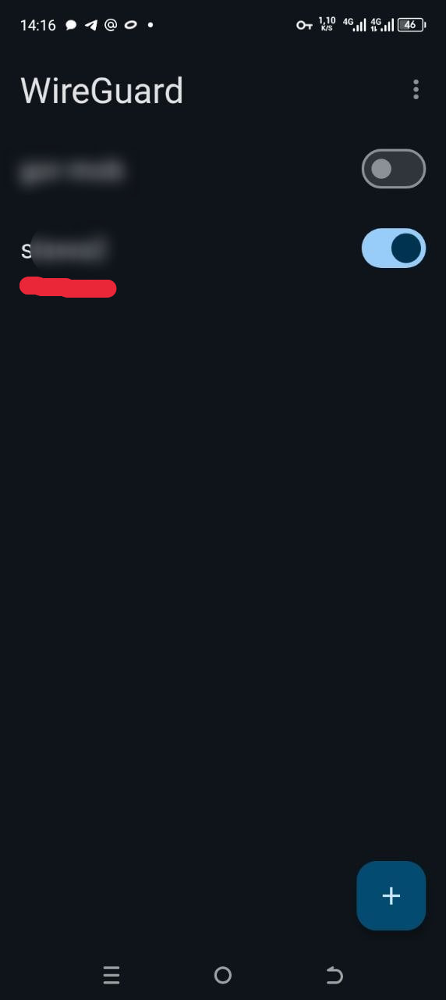
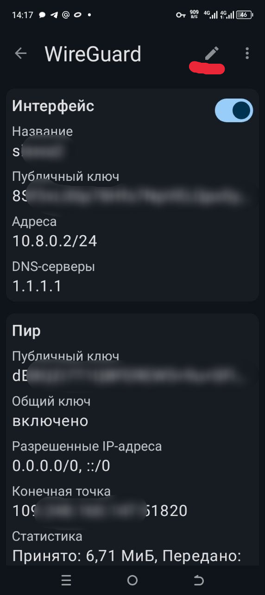
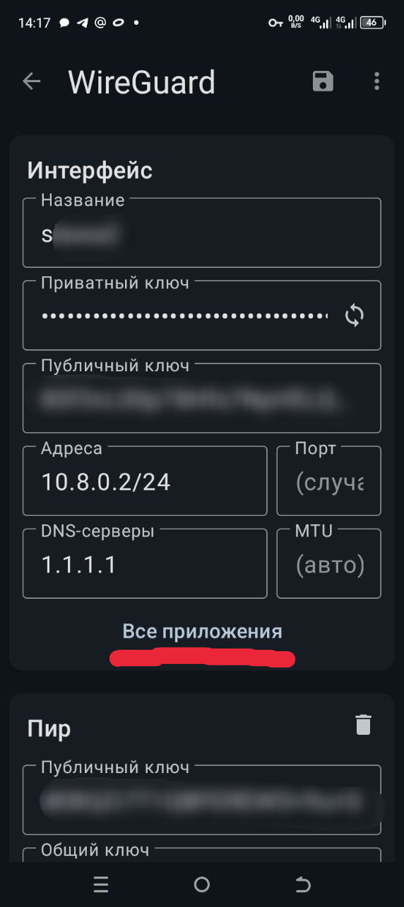
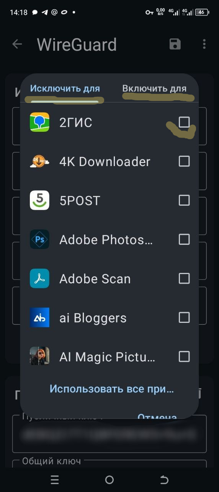
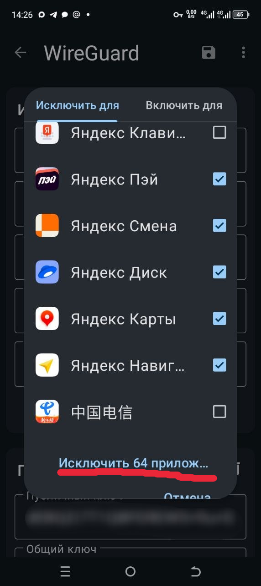
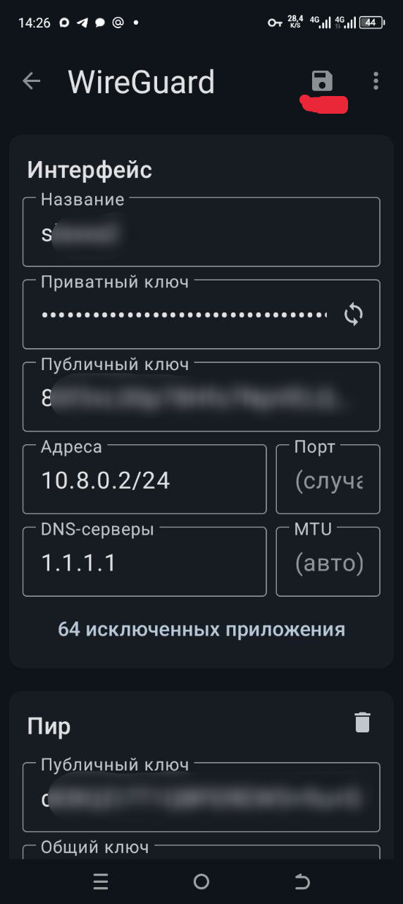
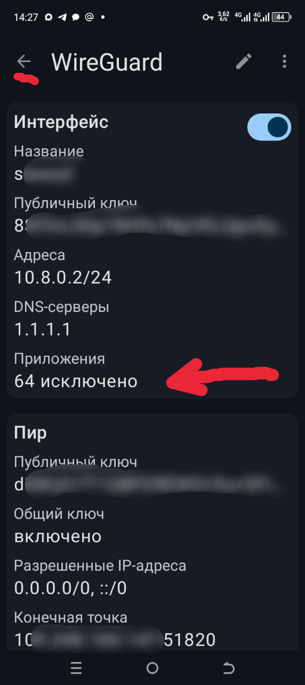

#  Настройка исключений приложений в WireGuard для Android

## ️ Дисклеймер

**Данная инструкция предназначена для технических специалистов и системных администраторов**, использующих WireGuard для подключения к **личным/корпоративным серверам**.

Инструкция носит исключительно **технико-образовательный характер** и демонстрирует возможности настройки VPN-клиента. Она не направлена на обход ограничений или доступ к запрещенным ресурсам.

---

##  Зачем это нужно?

На устройствах **Android** WireGuard позволяет настроить **раздельное туннелирование на уровне приложений**:

- ✅ **Исключить приложения** — выбранные приложения работают **в обход VPN** (через обычное подключение)
- ✅ **Включить только определенные** — только выбранные приложения работают **через VPN**, остальной трафик идет напрямую

Это удобно, когда:
- Некоторые приложения не работают через VPN (банки, госуслуги)
- Хотите сэкономить трафик VPN для определенных приложений
- Нужен быстрый доступ к локальным сервисам

---

##  Пошаговая инструкция

### Шаг 1: Откройте настройки туннеля

Откройте приложение WireGuard и нажмите на **название вашего туннеля**

  

---

### Шаг 2: Перейдите в режим редактирования

Нажмите на иконку **карандаша** ✏️ в правом верхнем углу экрана

  

---

### Шаг 3: Найдите раздел "Все приложения"

В разделе **«Интерфейс»** прокрутите вниз и найдите строку **«Все приложения»**

  

Нажмите на эту строку.

---

### Шаг 4: Выберите режим работы

Выберите один из двух режимов:

#### 🔹 Режим «Исключить для»
Выбранные приложения будут работать **в обход VPN** (через обычное интернет-подключение)

#### 🔹 Режим «Включить для»  
Только выбранные приложения будут работать **через VPN**, весь остальной трафик пойдет напрямую

  

---

### Шаг 5: Выберите приложения

Отметьте галочками ✅ нужные приложения из списка

  

---

### Шаг 6: Подтвердите выбор

Нажмите на строку под списком приложений:
- **«Исключить ХХ прил...»** — если выбрали режим исключения
- **«Включить ХХ прил...»** — если выбрали режим включения

где **ХХ** — количество выбранных приложений.

---

### Шаг 7: Сохраните настройки

Нажмите иконку **дискеты**  в правом верхнем углу для сохранения изменений

  

Затем нажмите стрелку **«Назад»** ← для возврата к главному экрану

  

---

## 💡 Рекомендации по настройке

### Какие приложения исключить из VPN?

**️ Важно:** Многие сервисы требуют прямого подключения и блокируют VPN. Исключайте только те приложения, которые не работают через VPN.

| Категория | Примеры | Почему исключать |
|-----------|---------|------------------|
| 🏦 **Банковские приложения** | Сбербанк Онлайн, Тинькофф, ВТБ Онлайн, Альфа-Банк | Многие банки блокируют подключения через VPN/прокси из соображений безопасности |
| 🏛️ **Государственные сервисы** | Госуслуги, ФНС (Личный кабинет налогоплательщика), ПФР | Требуют прямого российского IP, часто определяют и блокируют VPN |
| 🎫 **Сервисы с привязкой к региону** | Кинопоиск HD, Иви, More.tv, START | Могут ограничивать доступ при обнаружении VPN |
| 🛒 **Маркетплейсы** | Ozon, Wildberries, Яндекс Маркет | РКН требует прямого подключения, блокируют доступ через VPN |
| 🚖 **Такси и доставка** | Яндекс Такси, Ситимобил, Delivery Club | Проблемы с определением местоположения |
| 📺 **Стриминговые сервисы** | Okko, Premier, Kion | Блокировка VPN для соблюдения лицензионных соглашений |

**❗ Не исключайте из VPN:**
- Браузеры (Chrome, Firefox) — если хотите, чтобы весь веб-трафик шел через VPN
- Социальные сети — для обеспечения безопасности соединения

### Какой режим выбрать?

**Режим «Исключить для»** — рекомендуется в большинстве случаев:
- ✅ Весь трафик по умолчанию идет через VPN
- ✅ Исключаете только проблемные приложения (банки, госсервисы)

**Режим «Включить для»** — для специфических сценариев:
- ⚠️ Только выбранные приложения идут через VPN
- ⚠️ Весь остальной трафик идет напрямую без защиты VPN
- ✅ Полезно, если VPN нужен только для конкретных приложений

---

## ️ Важные замечания

1. **Сохраняйте настройки** — не забудьте нажать иконку дискеты 💾 перед выходом
2. **Проверяйте работу** — после настройки убедитесь, что исключения работают корректно
3. **Обновляйте список** — при установке новых приложений добавьте их в исключения при необходимости
4. **Только Android** — эта функция доступна только на Android, на iOS не поддерживается

---

**📌 Важно:** Функция исключений приложений доступна в клиентах WireGuard для Android. На iOS эта функция не поддерживается.
